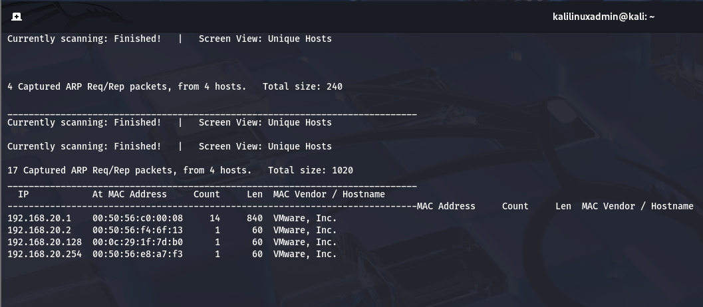
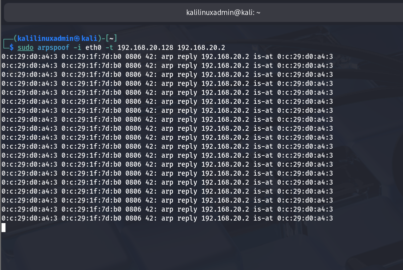
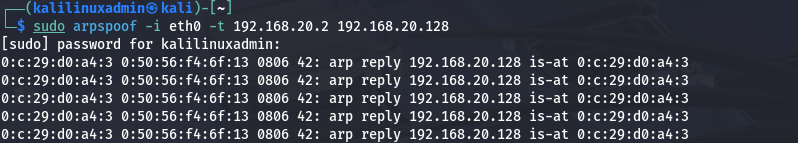

# 🔐 ARP Spoofing Lab — Educational Documentation

> ⚠️ **Disclaimer:** Everything in this repository was performed **strictly in a safe,
> isolated VMware lab environment** for educational purposes only.
> **Never attempt this on any real or public network.**
> Unauthorized use is illegal and unethical.

---
## 🚀 What You'll Learn

- How ARP Spoofing works in real networks  
- How attackers become Man-in-the-Middle  
- How to intercept traffic safely in a lab  
- How to defend against this attack


## 📌 What is ARP Spoofing?

**ARP** stands for **Address Resolution Protocol**.

It is a protocol that maps an **IP address** (like `192.168.20.128`) to a **MAC address**
(the physical hardware address of a device on a network).

**ARP Spoofing** is a Man-in-the-Middle (MITM) attack where an attacker sends **fake ARP
messages** on a local network. This tricks other devices into sending their traffic to the
attacker's machine instead of the real destination.

---

## 🧠 How ARP Works Normally

```
Your Device  ──►  Router  ──►  Internet
```

Every device on a network trusts ARP replies. There is no verification — if someone
sends a reply saying "I am the router," the device believes it.

---

## ⚔️ How ARP Spoofing Works

```
Your Device  ──►  Attacker (Kali)  ──►  Router  ──►  Internet
```

The attacker sends fake ARP replies to:
1. The **victim** — saying "I am the router, send your traffic to me"
2. The **router** — saying "I am the victim, send their traffic to me"

Now **all traffic flows through the attacker silently**. The victim has no idea.

---

## 🖥️ Lab Environment

| Component      | Details                              |
|----------------|--------------------------------------|
| Attacker OS    | Kali Linux                           |
| Victim OS      | Windows 11                           |
| Network Type   | Isolated VMware Host-Only Network    |
| Network Range  | 192.168.20.0/24                      |
| Attacker IP    | 192.168.20.129                       |
| Victim IP      | 192.168.20.128                       |
| Gateway IP     | 192.168.20.2                         |

---

## 🛠️ Tools Used

| Tool          | Purpose                                      |
|---------------|----------------------------------------------|
| `arpspoof`    | Send fake ARP messages (from dsniff suite)   |
| `Wireshark`   | Capture and analyze network traffic          |
| `netdiscover` | Discover all devices on the network          |
| `tcpdump`     | Command-line packet capture                  |

---

## 📋 Step-by-Step Attack Flow

### Step 1 — Find Devices on the Network

Before attacking, identify the victim IP and gateway IP.

```bash
sudo netdiscover -i eth0 -r 192.168.20.0/24
```

**What this does:**
- Scans the entire `192.168.20.0/24` network
- Lists all active devices with their IP and MAC addresses
- Helps confirm victim IP (`192.168.20.128`) and gateway IP (`192.168.20.2`)

  
  


---

### Step 2 — Enable IP Forwarding

```bash
echo 1 > /proc/sys/net/ipv4/ip_forward
```

**Why this is needed:**
- By default, Kali Linux drops packets that are not meant for it
- Since we are placing Kali in the middle, victim's packets arrive at Kali
- This command tells Kali to **forward those packets** to the real gateway
- Without this, the victim loses internet access and gets suspicious

**Verify it is enabled:**
```bash
cat /proc/sys/net/ipv4/ip_forward
# Output should be: 1
```

---

### Step 3 — ARP Spoof the Victim

Open **Terminal 1** and run:

```bash
sudo arpspoof -i eth0 -t 192.168.20.128 192.168.20.2
```

**Breaking down the command:**

| Part                | Meaning                                      |
|---------------------|----------------------------------------------|
| `arpspoof`          | The tool we are using                        |
| `-i eth0`           | Use the `eth0` network interface             |
| `-t 192.168.20.128` | Target = the victim machine                  |
| `192.168.20.2`      | Tell the victim that WE are this IP (gateway)|

**What this does:**
- Continuously sends fake ARP replies to the victim
- Tells the victim: "I (Kali) am the router — send all your traffic to me"

 

> Leave this terminal running. Do not close it.

---

### Step 4 — ARP Spoof the Gateway

Open **Terminal 2** and run:

```bash
sudo arpspoof -i eth0 -t 192.168.20.2 192.168.20.128
```

**What this does:**
- Tells the gateway (router): "I (Kali) am the victim — send their traffic to me"
- This completes the **two-way MITM** — traffic flows both directions through Kali



> Leave this terminal running too.

---

### Step 5 — Verify the Attack is Working

On **Kali**, open Wireshark:

```bash
sudo wireshark
```

1. Select the `eth0` interface
2. Click the blue shark fin to start capturing
3. In the filter bar, type: `ip.src == 192.168.20.128`
4. You will now see **all packets from the victim** flowing through Kali

On the **victim machine (Windows 11)**, open CMD and run:

```bash
arp -a
```

Look at the entry for the **gateway IP** (`192.168.20.2`). If the attack is working,
its MAC address will match Kali's MAC address — not the real router's.

---

### Step 6 — Monitor Traffic with tcpdump (Optional)

```bash
sudo tcpdump -i eth0 src 192.168.20.128
```

**What this does:**
- Captures all packets coming from the victim in real time
- You can see every website the victim visits
- HTTP traffic content is visible in plain text

---

### Step 7 — Cleanup After Lab

Always clean up when done. Run these commands:

```bash
# Stop IP forwarding (return to default)
echo 0 > /proc/sys/net/ipv4/ip_forward

# Stop arpspoof in both terminals
# Press CTRL+C in Terminal 1 and Terminal 2

# Verify ARP processes are stopped
ps aux | grep arpspoof
```

**Why cleanup matters:**
- Restores the victim's normal network routing
- Removes Kali from the middle
- Leaves the lab in a clean state

---

## 🔍 Observations

- Victim internet remained active ✅  
  → IP forwarding ensured no network disruption  

- ARP table successfully poisoned ✅  
  → Victim mapped gateway IP to attacker's MAC  

- Traffic routed through attacker silently ✅  
  → MITM position achieved successfully  

- No alert shown to victim ❌  
  → ARP has no authentication mechanism

## 👁️ What an Attacker Can See

When ARP spoofing is active and the victim browses normally:

| Traffic Type           | Visible to Attacker? |
|------------------------|----------------------|
| HTTP websites visited  | ✅ Yes — full content |
| HTTP login credentials | ✅ Yes — plain text   |
| DNS queries            | ✅ Yes — every domain |
| HTTPS content          | ❌ No — encrypted     |
| HTTPS domains visited  | ⚠️ Partially (SNI)   |

---

## 🛡️ How to Defend Against ARP Spoofing

| Defense                  | How It Helps                                          |
|--------------------------|-------------------------------------------------------|
| **Use HTTPS only**       | Data is encrypted even if intercepted                 |
| **VPN**                  | Encrypts all traffic end-to-end                       |
| **DNS over HTTPS (DoH)** | Prevents DNS query interception                       |
| **Dynamic ARP Inspection**| Network switch-level protection (enterprise)         |
| **Avoid public WiFi**    | Eliminates the attack surface entirely                |
| **Static ARP entries**   | Manually pin IP-to-MAC mappings to prevent poisoning  |

---

## 📚 Key Takeaways

- ARP Spoofing requires **no malware**, **no phishing link**, and **no suspicious email**
- Simply being on the **same network** is enough for the attack to work
- **HTTP traffic is fully visible** to an attacker — never enter credentials on HTTP sites
- **HTTPS protects your data** even if traffic is intercepted
- **VPNs** are the most practical protection on untrusted networks (hotels, coffee shops)

---

## 🔗 References

- [ARP Protocol — Wikipedia](https://en.wikipedia.org/wiki/Address_Resolution_Protocol)
- [dsniff / arpspoof — Kali Tools](https://www.kali.org/tools/dsniff/)
- [Wireshark Official Site](https://www.wireshark.org/)
- [HSTS — MDN Web Docs](https://developer.mozilla.org/en-US/docs/Web/HTTP/Headers/Strict-Transport-Security)

---

## 👤 Author

Cybersecurity enthusiast learning ethical hacking and network security.
All work performed in safe, isolated lab environments for educational purposes only.

---

⭐ *If you found this helpful, please star this repository!*
